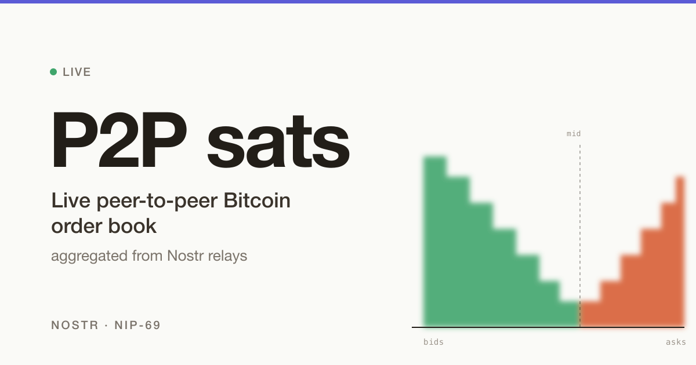

# P2P sats

Live peer-to-peer Bitcoin order book aggregated from Nostr relays.



**Live site:** https://p2psats.com

## What it is

P2P sats is a read-only aggregator of peer-to-peer Bitcoin orders. It connects to public Nostr relays where platforms like RoboSats, HodlHodl lnp2pbot, Mostro and Peach broadcast their offers under [NIP-69](https://github.com/nostr-protocol/nips/blob/master/69.md), parses the events, and renders everything as a unified order book with depth chart, spread, and crossed-pair detection.

No accounts. No orders posted from here. No funds touched. Just a window into what's already public on the relays.

## Why

The P2P Bitcoin market is fragmented. Liquidity, prices, and payment methods are spread across separate apps and bots, each with its own siloed slice of the order flow. To find the best ask you currently have to flip between four different UIs. Most people just don't bother, and liquidity stays thin where it could be deep.

P2P sats unifies the view to (hopefully) make the market stronger, especially for users in regions where non-KYC and local payment methods are essential.

## Features

- Live aggregation from four NIP-69 relays (Mostro, lnp2pbot, RoboSats, Peach)
- Depth chart with bid/ask area and a Yadio reference price line
- Spread, mid-price, best bid/ask, total depth on both sides
- Crossed-pair detection (cross-platform arbitrage candidates)
- 9 quote currencies (USD, EUR, BRL, ARS, MXN, VES, ZAR, RUB, PEN)
- 3 locales: English, Spanish (es-419), Brazilian Portuguese (pt-BR)
- Statically prerendered (vite-ssg) for fast first paint and SEO
- Mobile-friendly responsive layout

## Supported relays

| Platform | Relay | Status |
|---|---|---|
| Mostro | `relay.mostro.network` | active |
| lnp2pbot | `relay.lnp2pbot.com` | active |
| RoboSats | `nostr.robosats.org` | active |
| Peach | `relay.peachbitcoin.com` | active |

Adding a new platform is mostly a matter of identifying its NIP-69 relay and adding it to `src/lib/data.ts`. PRs welcome.

## Quick start

Requires Node 22.12+ (see `.nvmrc`).

```bash
git clone git@github.com:bilthon/p2psats.git
cd p2psats
nvm use            # picks up .nvmrc
npm install
npm run dev        # http://localhost:5173
```

### Other scripts

```bash
npm run type-check   # vue-tsc
npm run build        # vue-tsc + vite-ssg prerender (4 static HTML pages)
npm run preview      # serve dist/
```

### Environment

Copy `.env.example` to `.env` (or `.env.local`) and fill in the values. Only `VITE_*`-prefixed vars are exposed to the browser bundle.

| Variable | Required? | Purpose |
|---|---|---|
| `VITE_API_URL` | required for alerts | Backend REST API base URL consumed by `apiClient.ts`. **Must include the `/api` prefix** (every backend route is mounted under `/api`). Defaults to `http://localhost:3000/api` when unset. |
| `VITE_SITE_URL` | optional | Canonical URL used in OG meta tags. Defaults to `https://p2psats.com`. Override in preview / staging so OG cards point at the right host. |
| `VITE_CONTACT_NPUB` | optional | Nostr pubkey shown on `/contact`. Leave blank to render "not configured". |
| `VITE_CONTACT_EMAIL` | optional | Email shown on `/contact`. Leave blank to render "not configured". |

See `.env.example` for the canonical list with inline comments.

## Project structure

```
src/
  views/        Home, Alerts, About, Contact
  components/   OrderBook, DepthChart, ArbitrageBanner, dialogs, switchers
  services/     nostrOrderbook (SimplePool subscription), btcRates (Yadio)
  lib/
    nip69/      NIP-69 event parser
    orderAdapter.ts   raw NIP-69 -> UI Order
    arbitrage.ts      crossed-pair detection
    data.ts           source / relay / payment-method registry
  stores/       Pinia app store
  i18n/         vue-i18n setup + locale JSON files
public/
  og.svg, og.png    social card (source + rendered)
```

## Tech stack

- [Vue 3](https://vuejs.org/) + [Vite 5](https://vitejs.dev/) + TypeScript
- [vite-ssg](https://github.com/antfu-collective/vite-ssg) for static prerender
- [@unhead/vue](https://unhead.unjs.io/) for per-route head management
- [Pinia](https://pinia.vuejs.org/) for state
- [vue-i18n](https://vue-i18n.intlify.dev/) for translations
- [nostr-tools](https://github.com/nbd-wtf/nostr-tools) for Nostr WebSocket subscriptions
- [vue-echarts](https://vue-echarts.dev/) + [echarts](https://echarts.apache.org/) for the depth chart

## Regenerating the OG image

The social card source lives at `public/og.svg`. After edits:

```bash
rsvg-convert -w 1200 -h 630 public/og.svg -o public/og.png
```

(`brew install librsvg` if you don't have `rsvg-convert` already.)

## Contributing

Issues and PRs welcome. Easy first contributions:

- Add a new NIP-69 relay (`src/lib/data.ts`, `src/services/nostrOrderbook.ts`)
- Add a payment-method label (`src/lib/data.ts`)
- Translation improvements (`src/i18n/locales/*.json`)
- Bug reports for anything that looks wrong in the order data

Before opening a PR, please run `npm run type-check && npm run build` so the prerender still passes.

## Related work

- [**p2p.band**](https://p2p.band) by [KoalaSat](https://njump.me/npub1v3tgrwwsv7c6xckyhm5dmluc05jxd4yeqhpxew87chn0kua0tjzqc6yvjh) does something very similar. P2P sats was built independently; the more frontends on this public data, the better.
- The [NIP-69 spec](https://github.com/nostr-protocol/nips/blob/master/69.md), without which none of this would exist.
- The RoboSats, lnp2pbot, Mostro and Peach teams, for publishing their order data openly to Nostr.

## License

[MIT](./LICENSE) © Bilthon
